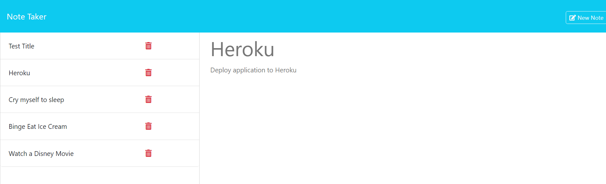

# Note Taker App
  []
  ## Description
  This project is to allow the user to create, save, and delete notes for the sake of remembering every day things!
  ## Link To Deployed App
  https://note-taker-lukes-804e08b36357.herokuapp.com/

  ## Installation
  By following the link to the Heroku deployed application, the user does not need to install anything. If the user feels so compelled to download this repository and test it on their localhost environment, then all they need to do is cd into the folder, npm install to install the node modules, and then 'npm run start' to start the application on port 3001. Then the simply opens the browser of their choice and navigates to http://localhost:3001/

  ## User Story
  AS A small business owner
I WANT to be able to write and save notes
SO THAT I can organize my thoughts and keep track of tasks I need to complete

  ## Acceptance Criteria
  GIVEN a note-taking application
WHEN I open the Note Taker
THEN I am presented with a landing page with a link to a notes page
WHEN I click on the link to the notes page
THEN I am presented with a page with existing notes listed in the left-hand column, plus empty fields to enter a new note title and the note’s text in the right-hand column
WHEN I enter a new note title and the note’s text
THEN a "Save Note" button and a "Clear Form" button appear in the navigation at the top of the page
WHEN I click on the Save button
THEN the new note I have entered is saved and appears in the left-hand column with the other existing notes and the buttons in the navigation disappear
WHEN I click on an existing note in the list in the left-hand column
THEN that note appears in the right-hand column and a "New Note" button appears in the navigation
WHEN I click on the "New Note" button in the navigation at the top of the page
THEN I am presented with empty fields to enter a new note title and the note’s text in the right-hand column and the button disappears

  ## Usage
  To use this application the user can simply click the get started button on the landing page. This will bring them to the notes page where they must enter both a title and a note in order for the save note button to appear. When the user clicks the saved note the title of that note displays in the aside. Next to each saved note is a trash can icon which, when clicked, deletes that note. The user may also view the full note, both the title and the contents of the note by clicking on the desired saved note on the aside, which will then display that note in the main area of the page. When there is a saved note being displayed in the main area, a new note icon appears which can be clicked to make a new note. When the user leaves the note app, they can return to it at any point and their notes will be saved in the database, ready for viewing.
  

  ## Contributing
  This project was created by Luke Stroehlein with code from BCS. Much help was found on the internet including resources such as w3schools and stack overflow.
  ## License
  This project is licensed under the MIT license.
  ## Tests
  The best way to test this project is to run the application through the local host and use the Chrome dev tools console to inspect and evaluate the application. This is the primary manner in which the debugging was done to make this project possible.
  ## Challenges
  This was a surprisingly difficult challenge. Despite being given base code, api-routes.js file gave me the most trouble. Issues I faced included syntax errors, code put in the wrong order, and the db.json file not saving correctly. It took a lot of tinkering to get this application running smoothly. I had the boilerplate code done in approximately 2 hours, and then, this is not an exaggeration, took another 10 hours to perfect and debug the functionality of the application. Some errors took multiple hours to resolve. I tell people, 90% of the work is done in 10% of the time, and the last 10% of the work takes 90% of the time. Overall I am satisfied with how this project turned out and I'm happy to be done with it and to continue honing my debugging skills.

  ## Questions
  If you have any questions, please feel free to reach out to me at strolinedigital@gmail.com. 
  You can also view my GitHub profile at https://github.com/StrolineDigital

